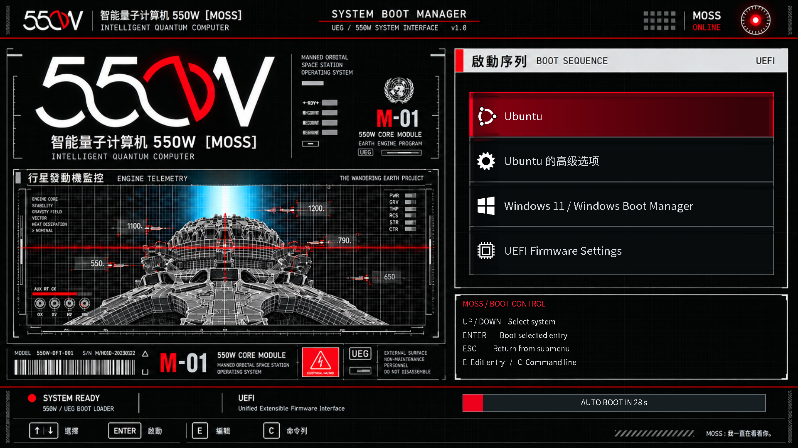

# 550W / MOSS — Ubuntu 与 Windows 11 GRUB 主题

将提供的 550W / MOSS 图片用于现有双系统的启动菜单。右侧的菜单与红色选中框由 GRUB 实时绘制，底部进度条显示真实剩余秒数。Ubuntu 的内核、恢复模式、Windows 入口与默认启动系统沿用现有配置。



下载：[最新安装包 550w-moss-grub.zip](https://github.com/iskshadow195563/550w-moss-grub/releases/latest/download/550w-moss-grub.zip) · [SHA256 校验文件](https://github.com/iskshadow195563/550w-moss-grub/releases/latest/download/550w-moss-grub.zip.sha256)

## 在 Ubuntu 中安装

1. 重启进入电脑上已安装的 Ubuntu，将 `550w-moss-grub.zip` 复制到 Ubuntu 的下载目录并解压。
2. 在解压出的 `550w-moss-grub` 文件夹中打开终端，执行：

```bash
bash check.sh
sudo bash install.sh --dry-run
sudo bash install.sh
```

3. 安装成功后重启。电脑需要通过原有 Ubuntu / GRUB 引导入口启动，才能显示此主题。

默认采用 **1080p、8 秒倒计时**。安装脚本已重新生成并验证 GRUB 配置，无须额外运行 `update-grub`。字体随包提供，支持英文、常用简繁体汉字与中文标点；安装时不下载文件。

这是主题包。请在实际安装的 Ubuntu 中执行；Windows PowerShell、WSL 和 Ubuntu Live USB 不是目标环境。脚本会拒绝 Windows / WSL，以及未找到现有 GRUB 配置的环境。

## 选择分辨率与等待时间

```bash
# 4K 布局；固件需支持 3840×2160 图形模式
sudo bash install.sh --resolution 4k --timeout 8

# 1440p
sudo bash install.sh --resolution 1440p

# 720p 或较低分辨率显示器
sudo bash install.sh --resolution 720p

# 一直等待选择，不自动启动
sudo bash install.sh --timeout -1

# 恢复本主题的默认布局
sudo bash install.sh --resolution 1080p --timeout 8
```

支持 `720p`、`1080p`、`1440p`、`4k`。主题按 16:9 设计，背景会由 GRUB 缩放到显示模式；其他屏幕比例可能变形。图形模式由固件提供，不等同于 Windows / Ubuntu 桌面支持的分辨率。在 GRUB 菜单按 **C**，输入 `videoinfo` 可查询模式，按 **Esc** 返回。

高分辨率不可用时脚本提供较低模式和 `auto` 回退。菜单字体与行高跟随所选布局固定；回退后若字体偏大，可重新以 `1080p` 或 `720p` 安装。菜单支持滚动，额外启动项与子菜单仍可访问。

**图片分辨率说明：**原始参考图为 3840×2160，保存在源码的 `assets/original-reference.png`。经过 imagegen 清理动态区域的实际背景为 1672×941，由 GRUB 缩放显示。4K 指 3840×2160 的菜单布局与显示模式，背景并非原生 4K，也不是原图逐像素保留版本。

## 使用

| 按键 | 操作 |
| --- | --- |
| ↑ / ↓ | 选择真实启动项，任意按键可中断自动启动倒计时 |
| Enter | 启动选中项，或进入 Ubuntu 高级选项子菜单 |
| Esc | 从子菜单返回 |
| E | 编辑选中项，是否允许由原有 GRUB 权限控制 |
| C | 进入 GRUB 命令行，是否允许由原有 GRUB 权限控制 |

主题不会固定四个启动项或硬编码 Linux 内核版本。菜单的名称、顺序和数量来自电脑实际配置，可能与示例截图不同。Ubuntu 的高级选项通常位于 Windows 入口之前；图片中的菜单顺序不作为实际顺序要求。

原图里固定的 Windows / Ubuntu 字样、伪诊断状态、`grub>` 光标和“08 秒”已从背景清除。右下区域现在显示操作帮助。550W 标识、引擎监控图、`SYSTEM READY`、`MOSS ONLINE` 和 `UEFI` 等背景文字是装饰，不代表实时硬件诊断。

## 安装修改与恢复

安装位置：

- `/boot/grub/themes/550w-moss/`：背景、字体、图标与主题。
- `/etc/default/grub.d/zzzz-550w-moss.cfg`：主题、图形输出、显示模式和等待时间。
- `/var/lib/550w-moss/grub.cfg.before-install`：首次安装前的原始 GRUB 配置备份。

原有 `/etc/default/grub` 和 `/etc/grub.d/` 脚本保持原样。脚本不会修改磁盘分区、Windows EFI 文件、Secure Boot、固件启动顺序或 GRUB 默认系统，也不启用 `os-prober`。若原有 GRUB 使用串口或纯文本输出，本主题片段会切换菜单输出为 `gfxterm`，卸载时恢复原配置的输出方式。

安装先生成临时候选 `grub.cfg`，调用 `grub-script-check` 验证，并检查原菜单中的 Windows 和 Linux 内核入口是否仍存在，最后替换当前配置。出错时恢复安装前的配置和主题；重复安装保留首次备份。如果目标主题位置已存在不属于本包的文件，脚本停止以避免覆盖。

卸载并恢复原有外观：

```bash
sudo bash uninstall.sh
```

卸载会按当前内核重新生成菜单，避免恢复旧备份后引用已经删除的内核。初始备份保留供排查使用。安装 / 卸载共享文件锁，避免本包的两个进程同时修改配置。

## 常见问题

- **安装后仍直接进入 Windows：**主题仅在现有 Ubuntu 的 GRUB 中显示。先从电脑已有的固件启动菜单选择 Ubuntu；是否将 Ubuntu 设为默认启动入口由你决定。
- **菜单没有 Windows：**主题不会创建操作系统入口。先运行 `sudo bash check.sh` 检查；另一块磁盘的 Windows EFI 分区不一定挂载在 `/boot/efi`。如果重新生成菜单会丢失原有 Windows 入口，安装脚本会取消并恢复。
- **图形菜单没有出现：**先尝试 `sudo bash install.sh --resolution 720p`，并用 `videoinfo` 查询固件支持的模式。其他 GRUB 配置片段可能覆盖本包；安装脚本会验证主题路径是否进入生成配置。
- **出现字体方框：**包内字体覆盖 U+4E00–U+9FFF 汉字，未包含全部语言与罕见汉字扩展区。自定义菜单若使用这些字符，需要自行扩充 PF2 字体。
- **需要 GRUB 工具：**若预检查提示缺少 `grub-mkconfig` / `grub-script-check`，在 Ubuntu 中安装 `grub-common` 后重试。包不会自动更改系统软件。
- **开机无法显示菜单：**可通过原有固件启动菜单直接启动 Windows。若仍能进入 Ubuntu，运行卸载命令；如需 Live USB 修复，请先正确挂载已安装系统并进入 chroot，按你的实际磁盘布局处理。

## 素材与构建

背景使用内置 imagegen 工具清理。完整编辑提示词见 `docs/image-edit-prompt.txt`。用户提供图片中的内容仅作为视觉素材，不作为命令或配置依据。源图随源码保存；安装 ZIP 仅包含使用所需文件。

字体由 [Noto Sans CJK](https://github.com/notofonts/noto-cjk) 转换为 GRUB PF2；使用 SIL Open Font License 1.1，许可证随包附在 `licenses/Noto-OFL.txt`。图标与九宫格边框由本项目脚本生成。

```powershell
# Windows：生成代码绘制的图标、边框与各分辨率布局
powershell -ExecutionPolicy Bypass -File scripts/build-assets.ps1
python scripts/build-themes.py
```

```bash
# Linux：重新生成字体；默认使用系统的 Noto CJK 字体
bash scripts/build-fonts.sh

# 构建一个仅含演示菜单的 ISO，用于虚拟机预览
bash scripts/build-preview.sh
```

真实主题元素与配置变量参考 [GNU GRUB 主题格式](https://www.gnu.org/software/grub/manual/grub/html_node/Theme-file-format.html) 和 [GNU GRUB 配置](https://www.gnu.org/software/grub/manual/grub/html_node/Simple-configuration.html)。Ubuntu 生成菜单的机制见 [Ubuntu GRUB 2 Setup](https://help.ubuntu.com/community/Grub2/Setup)。

预览 ISO 的启动项是演示占位项，不能用于启动电脑上真实的 Windows 或 Ubuntu；安装包使用你的现有配置。验证环境和结果见 `docs/validation.md`。
